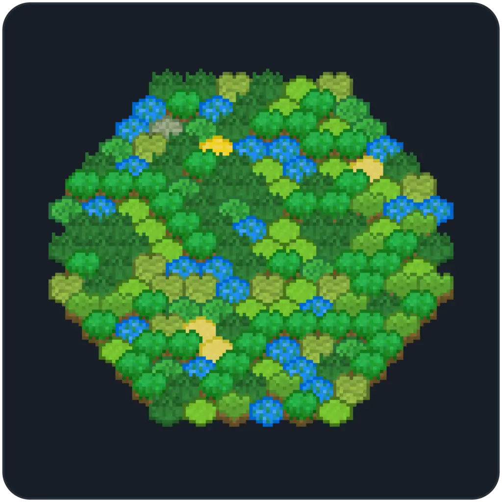

# Curta Golf
[**Website**](https://curta.wtf?tab=golf) - [**Docs**](https://curta.wtf/docs/golf/overview) - [**Twitter**](https://twitter.com/curta_ctf)

A king-of-the-hill style competition, where players optimize gas challenges.

The goal of players is to view [**Courses**](https://github.com/waterfall-mkt/curta-golf-courses) (challenges) and try to implement the most optimized solution for it. If the solution is valid, a **Par Token** with the corresponding metadata will be minted to their address. If it's the most efficient, they will be crowned the "King," and **King** NFT will be transferred to them.

## Deployments

<table>
    <thead>
        <tr>
            <th>Chain</th>
            <th>Chain ID</th>
            <th>Contract</th>
            <th>Deploy</th>
        </tr>
    </thead>
    <tbody>
        <tr>
            <td rowspan="3">Base</td>
            <td rowspan="3">8453</td>
            <td><code><a href="https://github.com/waterfall-mkt/curta-golf/blob/1449e59227a30ca720c04785339406515a0a2fea/src/CurtaGolf.sol">CurtaGolf</a></code></td>
            <td><code><a href="https://basescan.org/address/0xb8d97B24935C70cD931bbc6150e2596570997cE9">0xb8d97B24935C70cD931bbc6150e2596570997cE9</code></td>
        </tr>
        <tr>
            <td><code><a href="https://github.com/waterfall-mkt/curta-golf/blob/1449e59227a30ca720c04785339406515a0a2fea/src/Par.sol">Par</a></code></td>
            <td><code><a href="https://basescan.org/address/0x6B780314f95452E37D88A2F950Bbd3885851fD10">0x6B780314f95452E37D88A2F950Bbd3885851fD10</code></td>
        </tr>
        <tr>
            <td><code><a href="https://github.com/waterfall-mkt/curta-golf/blob/1449e59227a30ca720c04785339406515a0a2fea/src/utils/PurityChecker.sol">PurityChecker</a></code></td>
            <td><code><a href="https://basescan.org/address/0xE03Bbdb59444581f54f6823F0091FdF738E3Ce62">0xE03Bbdb59444581f54f6823F0091FdF738E3Ce62</code></td>
        </tr>
    </tbody>
<table>

## Usage
This project uses [**Foundry**](https://github.com/foundry-rs/foundry) as its development/testing framework.

### Installation

First, make sure you have Foundry installed. Then, run the following commands to clone the repo and install its dependencies:
```sh
git clone https://github.com/waterfall-mkt/curta-golf.git
cd curta-golf
forge install
```

### Testing
To run tests, run the following command:
```sh
forge test
```

To test the metadata output for `King` and `Art`, run the following commands:
```sh
forge script script/metadata/PrintKingArt.s.sol:PrintKingArtScript --via-ir -vvv
forge script script/metadata/PrintPartArt.s.sol:PrintPartArtScript --via-ir -vvv
```

### Coverage
To view coverage, run the following command:
```sh
forge coverage
```

To generate a report, run the following command:
```sh
forge coverage --report lcov
```

> [!NOTE]
> It may be helpful to use an extension like [**Coverage Gutters**](https://marketplace.visualstudio.com/items?itemName=ryanluker.vscode-coverage-gutters) to display the coverage over the code.

## Deploying

There are three core contracts that get deployed in [`Deploy.s.sol`](https://github.com/waterfall-mkt/curta-golf/blob/main/script/Deploy.s.sol): `PurityChecker.sol`, `Par.sol`, and `CurtaGolf.sol`. We also make use of three external libraries. These are: `Perlin.sol`, `ParArt.sol`, and `KingArt.sol`. `Perlin.sol` is used by `KingArt.sol`, which is used by `KingERC721.sol`, which is inherited by `CurtaGolf.sol`, and `ParArt.sol` is used by `Par.sol`. We include these in `foundry.toml` if we *don't* want them to be deployed alongside the contracts that use them. Otherwise, as an example, `Perlin.sol` and `KingArt.sol` would be deployed alongside `CurtaGolf.sol`.

A standard example for deploying everything would look like this:
```sh
forge script script/Deploy.s.sol:Deploy \
--rpc-url <rpc_url> \
--sender <sender> \
--account <account> \
--broadcast
```

If libraries have already been deployed we would do:
```sh
forge script script/Deploy.s.sol:Deploy \
--rpc-url <rpc_url> \
--sender <sender> \
--account <account> \
--broadcast \
--libraries src/utils/Perlin.sol:Perlin:<address> \
--libraries src/utils/metadata/KingArt.sol:KingArt:<address> \
--libraries src/utils/metadata/ParArt.sol:ParArt:<address>
```

> [!NOTE]
> When using `forge verify-contract` to verify a contract on a contract with libraries, the `--libraries` arg needs to be supplied in the form `--libraries <remapped path to lib>:<library name>:<address>`.

## Acknowledgements
* [**Optimizor Club**](https://github.com/OptimizorClub/optimizor)
* [**axic/puretea**](https://github.com/axic/puretea/)
